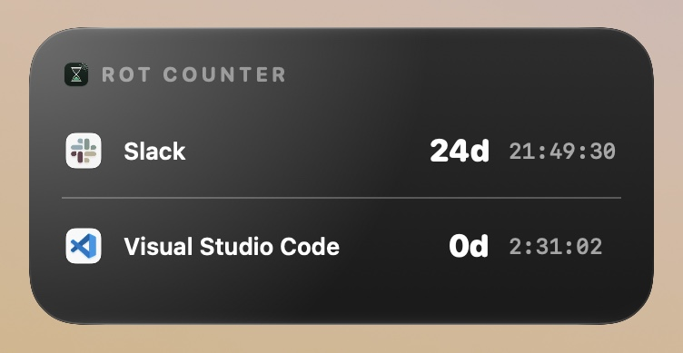
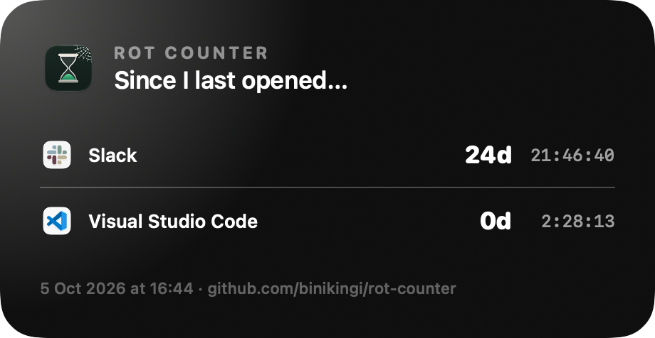

# Rot Counter ⏳

A macOS widget that counts the days, hours, minutes and seconds since you last opened the apps AI replaced.
VS Code, DataGrip, Postman, DBeaver: watch them rot.

<p align="center">
  
  
</p>

## Install

```sh
curl -fsSL https://raw.githubusercontent.com/binikingi/rot-counter/main/install.sh | bash
```

or download `RotCounter.zip` from [Releases](https://github.com/binikingi/rot-counter/releases/latest) and drag the app to `/Applications`.

Then click the hourglass in the menu bar → **Add App…**, and add the widget (right-click the desktop → **Edit Widgets**).
Requires macOS 14+.

## How it works

- The counter starts when you **quit** the app. While it's open, the widget shows **IN USE**.
- On first add, the start time is backfilled from Spotlight's "last used" date, so you don't start at zero.
- Small widget: one app (right-click → Edit Widget to pick). Medium/Large: a leaderboard.

## Build from source

```sh
brew install xcodegen
xcodegen && open RotCounter.xcodeproj   # set your team in project.yml
```

## License

MIT
